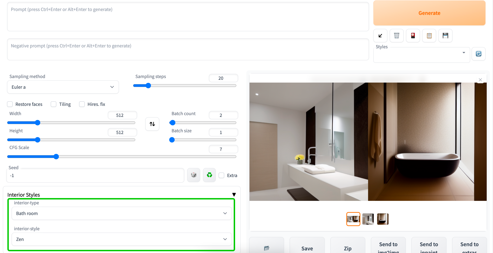

# SD-fast-interior-design-style-select
[Automatic1111 WEBUI](https://github.com/AUTOMATIC1111/stable-diffusion-webui) extension: A collection of interior design styles for generating images

## UI & Results

- interior type ratio
  - types collection like ["Living room", "Bedroom", "Kitchen", ...]
- interior style ratio
  - styles collection like ["Modern", "Minimalist", "Scandinavian", ...]

## Style Examples

